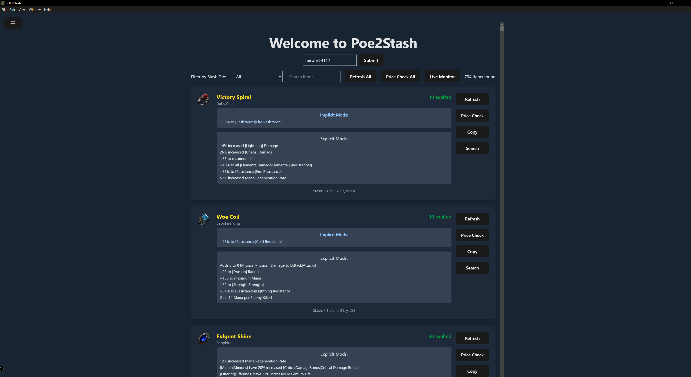
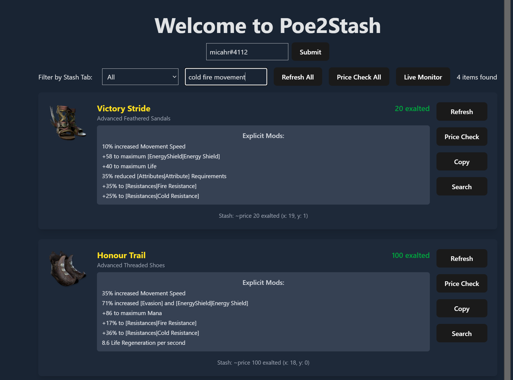
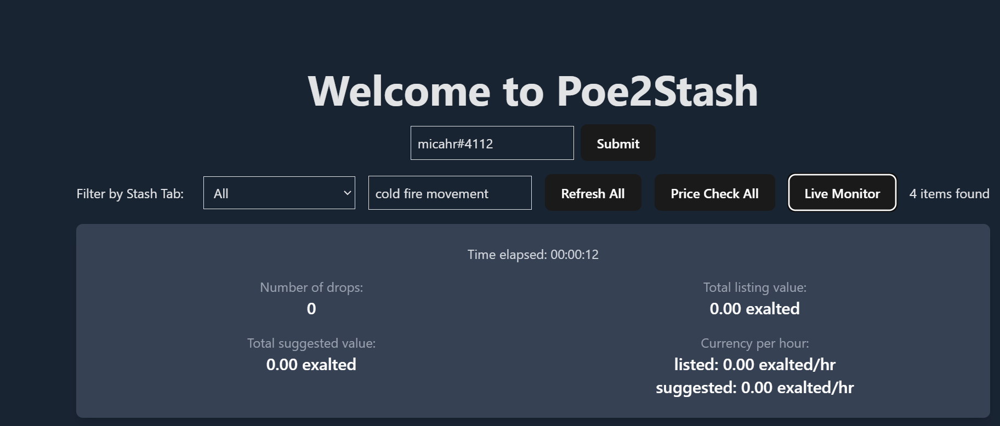
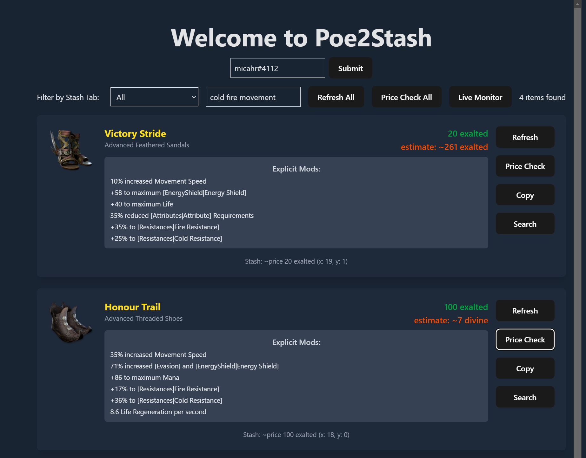
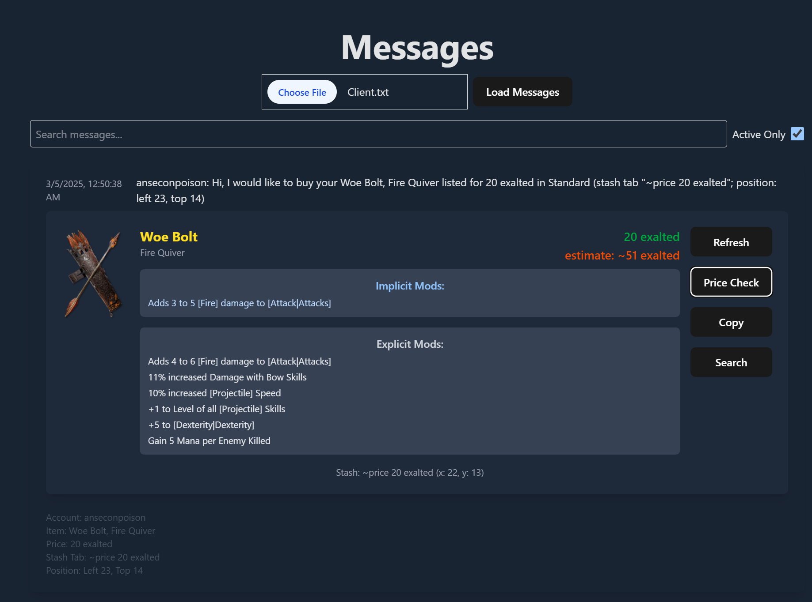

# Path of Exile 2 Trade Assistant

  

## Features

### 1. Account Synchronization

Easily sync your Path of Exile 2 account to fetch all your items.

- Fetches items from the trade website
- Automatically updates your local item database
- Provides real-time progress updates during synchronization

### 2. Item Management

Efficiently manage and view your items with powerful filtering options.

- Filter items by stash tab
- Search items using keywords
- View detailed item information

### 3. Live Monitoring

Stay up-to-date with new items and price changes in real-time.

- Receive instant notifications for new items
- Monitor price changes for your items
- Automatically update your item database with new information

### 4. Price Checking

Get accurate price estimates for your items to maximize your profits.

- Estimate prices for individual items
- Batch price check multiple items
- View price history and trends

### 5. Refresh Functionality

Keep your item database current with easy refresh options.

- Refresh individual items
- Perform a full refresh of all items
- Automatically update price estimates after refreshing

### 6. WebSocket Integration

Enjoy seamless real-time updates and interactions.

- Establish WebSocket connections for live data
- Receive instant updates from the Path of Exile 2 servers
- Ensure low-latency communication for a smooth user experience

### 7. Proxy Support

Access Path of Exile 2 trade API securely through a built-in proxy.

- Handle API rate limits efficiently
- Manage authentication and cookies automatically
- Ensure compliance with Path of Exile 2's terms of service

## Getting Started

1. Clone the repository
2. Install dependencies with `npm install`
3. Run the application with `npm start`
4. Enter your Path of Exile 2 account name to begin syncing your items

## Contributing

Contributions are welcome! Please feel free to submit a Pull Request.

## License

This project is licensed under the MIT License.